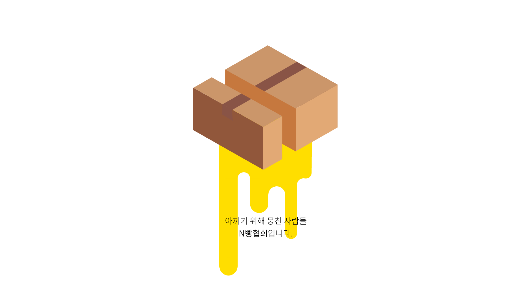
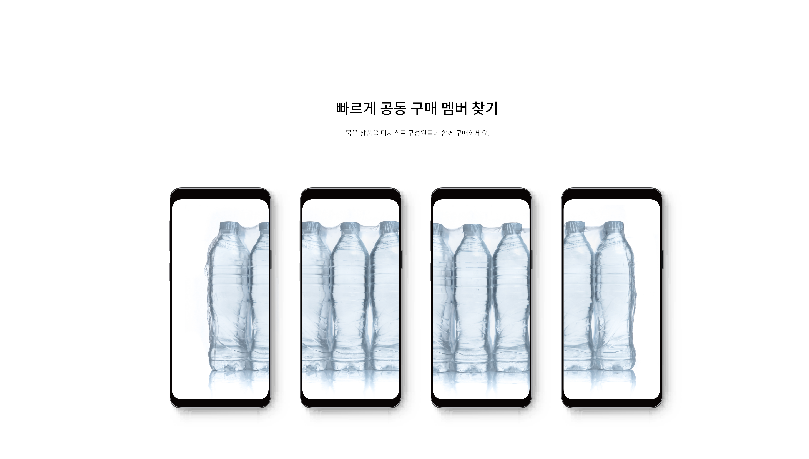
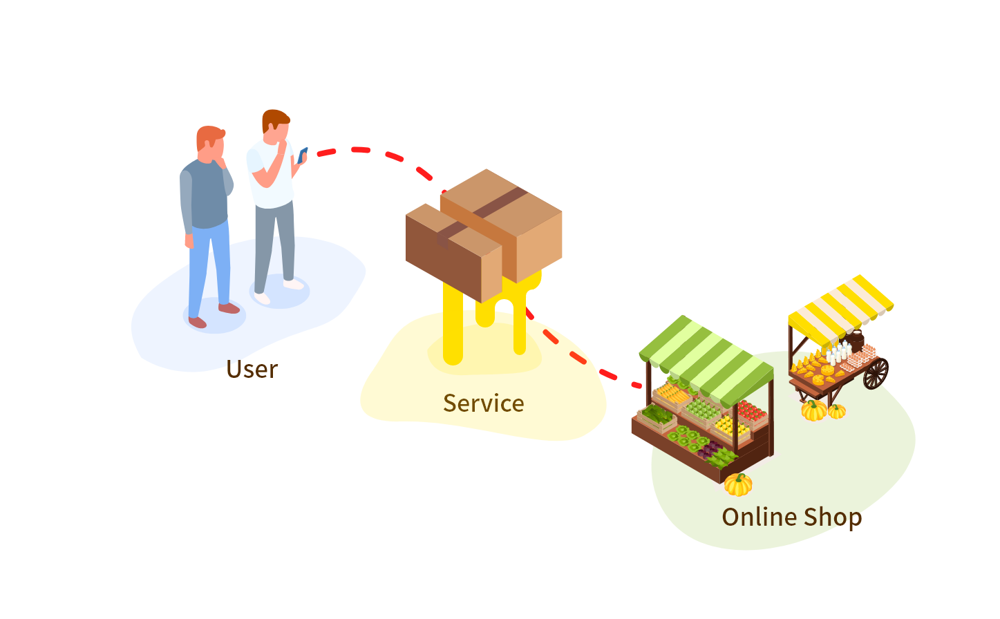
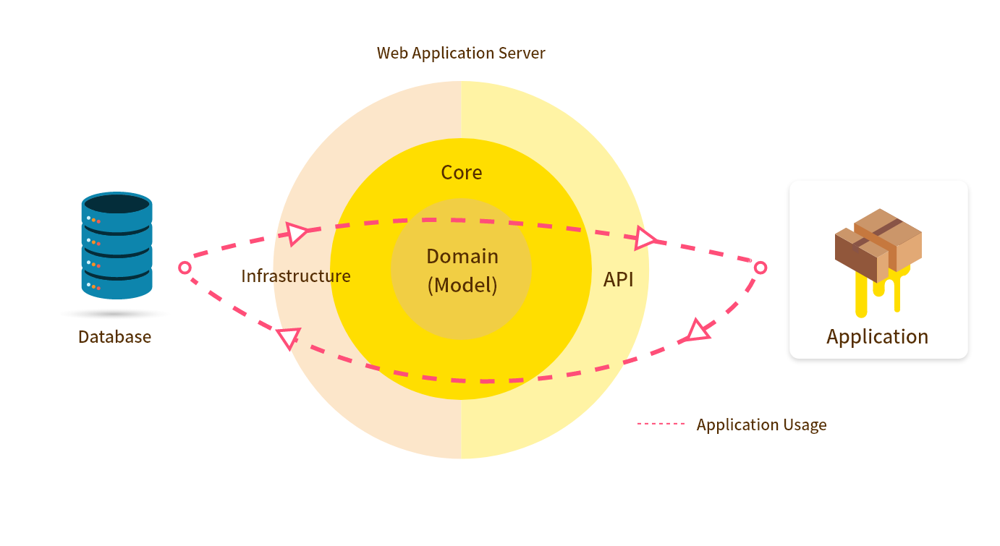
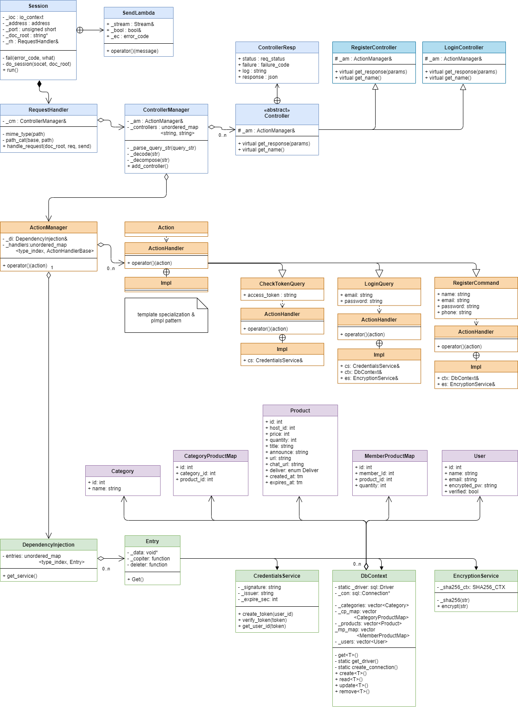

# n-bread-association
An application helps DGIST members buy bundled product together.

## purpose
When shopping online, bundled products are usually less expensive than those sold in
individual pieces. However, since it is not common for students to use or eat one thing that much,
DGIST members should pay more to buy less stuff. N빵협회 is an app to solve this problem. On this
app, DGIST members can see the list of products that other members registered. If one could not find
items they want, they can register a new one. In this case, the student is called the host. When they
find one, the user can enroll their name to the list to indicate that they want to buy that product. After
a sufficient number of members are enrolled, the host and the registered members can order the stuff
online.

## service diagram

## project

### 1. n-bread-association-exercise
프로젝트 `n-bread-association-exercise` 는 OOP 원정대원의 C++ 실력을 기르기 위해 진행한 모의 팀프로젝트로 단항식과 다항식을 간단하게 구현했습니다.

### 2. n-bread-association-server-exercise
프로젝트 `n-bread-association-server-exercise` 는 Boost Beast 를 이용하여 간단한 서버를 만들고 연습하기 위해서 만들어진 프로젝트입니다.

### 3. n-bread-association-server
프로젝트 `n-bread-association-server`는 웹 서버와 웹 애플리케이션 서버가 합쳐진 CMake로 관리되는 프로젝트입니다.

현재 클래스 다이어그램

파란색 : API
주황색 : Core
보라색 : Domain
초록색 : Infrastructure

종속성 정보  
[종속성 정보](n-bread-association-server/readme.md)

## timeline

2020-10-26. 아이디어 회의  
2020-10-27. 애플리케이션 디자인 초안 및 Proposal 작성  
2020-11-01. Github repository 생성 및 test project 실습  
2020-11-03. 테스트 서버 작성, Git 활용법 및 C++ 실습 진행  
2020-11-08. 세부사항 기획, 디자인 개선, 데이터베이스 설계 작업 진행  
2020-11-11. Infrastructure, Core 계층 추가  
2020-11-12. MySQL, OpenSSL, jwt 등의 인프라 구현  
2020-11-13. API 계층 추가, 웹 서버 구현  
2020-11-14. `n-bread-association-server` 프로젝트의 프레임워크 완성  
2020-11-15. 프로젝트 `n-bread-association-server`를 관리하기 위해 CMake 통합  
2020-11-17. 모델과 실제 DB간의 커플링 해제
2020-11-23. 팀 내 세미나 1회(주제: 생성자와 소멸자, new delete, 상속과 다형성)  
2020-11-24. 팀 내 세미나 2회(주제: l-value 레퍼런스와 r-value 레퍼런스, 템플릿 및 템플릿 특수화)  

## design

현재까지 만들어진 N빵협회 디자인을 [여기](https://xd.adobe.com/view/88d84aee-b64a-44ee-b642-7646100e6126-dd8b/) 에서 확인 해 보실 수 있습니다.

## Action

모든 코어 로직은 Action이라는 기본 단위로 작동합니다. Action은 모델에 영향을 미치는 Command와 조회 전용인 Query로 나누어집니다. Query는 Model로부터 ViewModel을 채워 오는 방식으로만 작동할 수 있습니다.

ViewModels

| Name               | Descrpition                                                  |
| ------------------ | ------------------------------------------------------------ |
| ProductView        | 상품의 미리보기 정보(카테고리, 만료일, 제목, 개당  가격, 현재 모집 개수, 전체 모집 개수, optional: 내 멤버 상태)를 담는 클래스 |
| Enum MemberType    | 상품에 대한 멤버 유형을 나타내는 열거형. public, nonhost, host 가 있음 |
| ProfileView        | 유저(자신)의 프로필 정보(유저id, 유저  이름, 이메일, 인증 여부)를 담는 클래스 |
| ProductDetailView  | 상품의 세부 정보(ProductView를  Composite하고 제품 상세 링크, 공지사항)을 담는 클래스 |
| Enum DeliveryState | 배송 상태를 나타내는 열거형.  preparing, on_deliver, finished 가 있음 |
| ProductNonhostView | ProductDetailView를 Composite하고 현재  참여 인원, 입금 인원, 나의 입금 상태, 내가 구매한 개수, 배송 상태,  커뮤니티 링크를 추가적으로 담는 클래스 |
| ProductHostView    | ProductDetailView를 Composite하고 배송  상태, MemberDetail의 배열을 담는 클래스 |
| UserView           | 유저의 정보(유저id, 유저 이름)                               |
| MemberDetail       | 상품 구매에 참여하는 멤버의 UserView,  구매 수량, 입금 상태를 담는 클래스 |

 

Public Queries

| Name              | Parameters | Return            | Description                                             | Implemented by | Tested |
| ----------------- | ---------- | ----------------- | ------------------------------------------------------- |----------------|--------|
| PublicGetProducts | Category[] | ProductView[]     | 주어진 카테고리에 속하는 상품 목록을 가져옵니다.            |                |        |
| GetCategories     | N/A        | Category[]        | 카테고리 목록을 가져옵니다.                               |                |        |
| SearchProducts    | string     | ProductView[]     | 주어진 문자열을 제목에 포함하는 상품 목록을 가져옵니다.     |                |        |
| GetProductDetail  | productId  | ProductDetailView | 주어진 id의 상품의 세부  정보를 가져옵니다.                |                |        |
| Login             | email, password | LoginState, AccessToken  | 이메일과 비밀번호를 받아 액세스 토큰을 받아옵니다. | 송대건 | N |
 

Restricted Queries

| Name              | Parameters                                 | Return             | Description                                                  | Implemented by | Tested |
| ----------------- | ------------------------------------------ | ------------------ | ------------------------------------------------------------ | ---------------|-------|
| GetProducts       | AccessToken,  Category[],  Enum MemberType | ProductView[]      | 멤버 유형에 따라 주어진 카테고리에 속하는 상품 목록을 가져옵니다. PublicGetProducts은 멤버 상태를 public으로만  반환하는 것과 달리 나의 멤버 상태를 추가적으로 받아올 수 있습니다. | | |
| GetProfile        | AccessToken                                | ProfileView        | 내 프로필 정보를 가져옵니다.                                 | | |
| GetProductNonhost | AccessToken  ProductId                     | ProductNonhostView | Nonhost멤버에게 필요한 상품 상세 정보를 가져옵니다. Nonhost가 아닌 유저가 요청하면 Privilege Exception을  throw합니다. | | |
| GetProductHost    | AccessToken  ProductId                     | ProductHostView    | Host멤버에게 필요한 상품 상세 정보를 가져옵니다.  Host가 아닌 유저가 요청하면 Privilege  Exception을 throw합니다. | | |
| GetMemberType     | AccessToken  ProductId                     | Enum MemberType    | 나의 멤버 상태를 받아옵니다.                                 | | |

 

Commands

| Name             | Parameters                                 | Return        | Description                                                  | Implemented by | Tested |
| ---------------- | ------------------------------------------ | ------------- | ------------------------------------------------------------ | -------------- | ------ |
| CancelMembership | AccessToken                                | bool          | 회원을 탈퇴하고 성공 여부를 반환합니다.                      | | |
| SetDepositState  | AccessToken  userId  productId  bool       | bool          | 유저의 입금 상태를 변경하고 성공 여부를 반환합니다. 내가 Host가 아닐 경우에는 실패합니다. User가 Product의 Member가  아닐 경우에는 Invalid access 실패합니다. | | |
| SetDeliveryState | AccessToken  ProductId  Enum DeliveryState | bool          | 상품의 배송 상태를 변경하고 성공 여부를 반환합니다. 내가 Host가 아닐 경우에는 실패합니다. | | |
| SetAnnounce      | AccessToken  ProductId  string             | bool          | 상품의 공지사항을 변경하고 성공 여부를 반환합니다. 내가 Host가 아닐 경우에는 실패합니다. | | |
| RegisterProduct  | AccessToken  Product                       | Int ProductId | 상품 등록 정보를 받아 상품을 등록합니다. 상품 등록 후 ProductId를 반환합니다. 만약 등록이 실패한다면 -1을 반환합니다. | | |
| Register        | email, password, name, phone                | bool          | 이메일, 비밀번호, 이름, 전화번호를 받아 유저를 새로 등록합니다. 실패 시 false를 반환합니다. | 송대건 | N |
 
## 코드 스타일

일관성 있는 코드를 위해, 이 프로젝트에선 정해진 코드 스타일만을 사용합니다.

### C++

C++ 코드 스타일은 `n-bread-association-server` 프로젝트에 있는 `.clang-format`에 정의되어있습니다. 로컬
저장소에 커밋하기 전, `clang-format`으로 소스에 서식을 적용하여야 합니다.
Visual Studio에서 `Ctrl + K`, `Ctrl + D`를 눌러 현재 편집 중인 코드에 서식을 적용할 수
있습니다. 동일한 맥락에서, 프로젝트 전체의 C++ 코드에선 다음 명명 규약을 지켜야 합니다.

#### 명명 규약

본 명명 규약에서 사용되는 명명 스타일은 다음과 같습니다.

* `PascalCase`: 단어의 첫 글자는 대문자이고, 나머지는 모두 소문자입니다.
* `_PascalCase`: PascalCase에 언더바가 추가되어있습니다.
* `snake_case`: 모든 글자가 소문자이고, 단어 사이에 언더바를 넣습니다.
* `_snake_case` : snake_case에 언더바가 추가되어있습니다.
* `BIG_SNAKE_CASE`: snake_case와 동일하지만, 모든 글자가 대문자입니다.
* `__H_HEADER_GUARD__`: 헤더 가드에 사용됩니다. BIG_SNAKE_CASE와 동일하지만, 앞
                          뒤로 언더바를 두 개씩 더 넣습니다.

| Type | Style | Example |
| --- | --- | --- |
| `class`/`struct`/`union`/`enum` | `PascalCase` | `MyClass` |
| Nested Public `class`/`struct`/`union`/`enum` | `PascalCase` | `MyClass::InnerClass` |
| Nested Public Type Alias | `PascalCase` + `Type` | `MyClass::IntegerType` |
| Nested Protected/Private `class`/`struct`/`union`/`enum` | `_PascalCase` | `MyClass::_InClass` |
| Nested Protected/Private Type Alias | `_PascalCase` + `Type` | `MyClass::_InType` |
| Template Parameter | `PascalCase` + `T` | `template <typename DataT>` |
| Template Parameter Pack | `PascalCase` + `Ts` | `template <typename ... DataTs>` |
| Public Member Variable | `snake_case` | `MyClass::user_name` |
| Protected/Private Member Variable | `_snake_case` | `MyClass::_user_name` |
| Getter/Setter | `snake_case` | `MyClass::user_name` |
| Public Member Function | `snake_case` | `MyClass::get_user` |
| Protected/Private Member Function | `_snake_case` | `MyClass::_change_user` |
| Namespace | `PascalCase` | `Namespace` |
| Global Function | `snake_case` | `snake_case` |
| Function Parameter | `snake_case` | `my_param` |
| Local Variable | `snake_case` | `my_temp` |
| Preprocessor Macro | `BIG_SNAKE_CASE` | `MY_MACRO` |
| Header Guard | `__H_FILE_NAME__` | See Below |

#### `const` 붙이기

`const`를 일관적인 위치에서 사용하기 위해, `const` 는 타입의 **뒤에** 붙입니다.

* Good: `T const *`
* Good: `T * const`
* Good: `T const &`
* Bad: `const T &`
